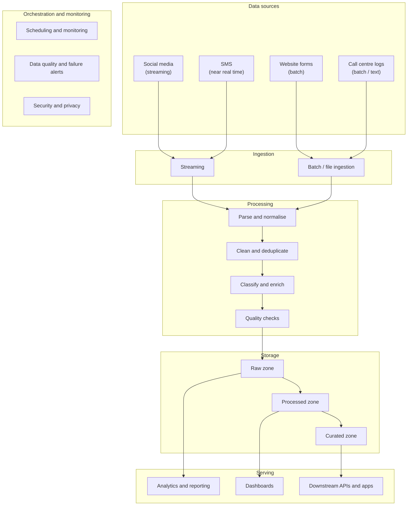

# Beejan Technologies

## Background

To address the data fragmentation and reporting delays at Beejan Technologies, I would move away from manual spreadsheet compilation and siloed team structures. In this document, I present a conceptual blueprint for an automated, unified end-to-end data pipeline, focusing on the architectural principles rather than on specific software vendors or tools.

## Conceptual End-to-End Data Pipeline

When I look at the pipeline concept shown below, I see a clear movement from scattered complaint channels, through ingestion and processing, into trusted storage and finally into reporting, alerts, and operational action. For me, the goal is not simply to move data from one system to another. The real goal is to create a dependable flow that turns raw customer feedback into information that people can use.

Same diagram as text (renders natively on GitHub)

## Design Choices and Thought Process

### 1. Overview and design thinking

Having looked at the problem, I realised that the issue was not due to lack of data, but that useful complaint information was scattered across different channels, teams and formats. My thought process was to create an end-to-end solution from data capture to trusted reporting for the end users.

### 2. Source identification

I focused on four sources: social media, call centre logs, SMS, and website forms. Since each source behaves differently, I would not treat them all in the same way. I treated social media and SMS as the most time-sensitive sources because they are fast-moving and can produce new complaint signals continuously, while call centre logs and website forms can usually be handled through batch or micro-batch processing.

### 3. Ingestion strategy

For ingestion, I would use a hybrid approach. I would stream or collect both social media and SMS data very frequently so that sudden complaint spikes can be detected early. For call centre logs and website forms, I would use batch or micro-batch processes depending on the reporting needs.

I would also make sure that all data first lands in a raw area exactly as it was received. I think this is important because it creates an audit trail and gives the organisation a safe way to reprocess the data later if business rules, formats, or classification logic change.

### 4. Processing and transformation

After ingestion, I would standardise the data into one complaint structure with fields such as complaint ID, customer reference, channel, timestamp, and complaint text. I would then remove duplicates, handle missing values, standardise contact details, and mask obvious personal information.

For classification, I would start with a simple taxonomy such as Network Quality, Billing, Customer Service, Digital Experience, and Other, then enrich the records with customer details and a basic sentiment flag.

### 5. Storage options

For storage, I would use three layers, following a medallion architecture:

| Layer | Zone | Contents |
|---|---|---|
| Bronze | Raw zone | Original files and events, exactly as received |
| Silver | Processed zone | Cleaned and enriched records |
| Gold | Curated zone | Ready-to-use reporting datasets |

This gives the reporting team dependable data while still allowing technical teams to return to the original source if needed. The warehouse or lakehouse decision can come later.

### 6. Serving layer

The serving layer is where the pipeline becomes useful. Analysts need trusted data for dashboards, operations teams need alerts when complaints rise, and product or support teams may need filtered views or APIs. My main principle was self-service, so teams can answer common questions without relying on repeated spreadsheet requests.

### 7. Orchestration, monitoring and DataOps

I also wanted the design to be realistic to operate. Streaming jobs should continuously capture data, while batch jobs should follow agreed schedules. The pipeline should quickly flag missing files, schema changes, failed quality checks, and missed service levels. I would also include lineage, documentation, version-controlled logic, and separate development, test, and production environments.

### 8. Assumptions, challenges and open questions

Several assumptions need to be confirmed before implementation. Beejan needs a reliable way to identify customers across channels, a shared complaint taxonomy, agreement on privacy and retention rules, and a clear view of how fast reporting must be.

There are also practical challenges to manage, including noisy social media text, duplicate complaints, changing source formats, language differences, and the cost of near real-time processing.

Before moving into build, I would confirm retention requirements, reporting service levels, search needs, language support, and ownership of each pipeline stage.

Finally, as with any development work, I would also expect edge cases to appear that may not have been considered at the design stage.